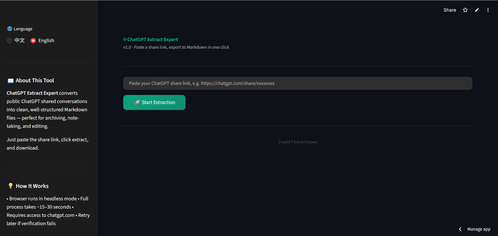

<div align="center">

# 🤖 ChatGPT Extract Expert (ChatGPT 提取专家)

**一键将 ChatGPT 分享链接转换为 Markdown 格式，完美保留代码块和数学公式。**  
**Convert ChatGPT share links into structured Markdown with perfect code and LaTeX support.**

<p align="center">
  <a href="https://chatgpt-share-scraper-hfj8wccxzappaytn9f6ntip.streamlit.app/">
    
  </a>
</p>

[](https://www.python.org/downloads/)
[](https://chatgpt-share-scraper-hfj8wccxzappaytn9f6ntip.streamlit.app/)
[](LICENSE)
---

[立即试用 Live Demo](https://chatgpt-share-scraper-hfj8wccxzappaytn9f6ntip.streamlit.app/) | [部署说明 Deployment](#-部署说明-deployment) | [免责声明 Disclaimer](#-免责声明-disclaimer)

</div>

## 📸 功能展示 / Showcase



## ✨ 核心卖点 / Key Features

- **🚀 快速提取 / Fast Extraction**：粘贴链接即可瞬间转换。/ Just paste the link and get results instantly.
- **💎 格式无损 / Lossless Content**：完美还原代码高亮、表格以及 LaTeX 数学公式。/ Perfectly preserves code blocks, tables, and LaTeX equations.
- **🛡️ 隐私安全 / Privacy & Security**：浏览器无头运行，不存储任何用户私有数据。/ Runs in headless mode; no user data is stored.
- **🔑 无需登录 / No Login Required**：直接访问公开分享链接，省去繁琐步骤。/ Works directly with public share links without account login.

---

## ☕ 请作者喝杯咖啡 / Buy me a coffee

如果你觉得这个工具帮到了你，欢迎支持作者持续维护本项目！  
If you find this tool helpful, feel free to support the developer. Your support keeps this project alive!

<div align="center">
  <br>
  <b>🌍 PayPal</b>
</div>


---

## �️ 部署说明 / Deployment

### 本地运行 / Local Run

1. **克隆项目 / Clone the repo:**
   ```bash
   git clone https://github.com/test12336/chatgpt-extract-expert.git
   cd chatgpt-extract-expert
   ```

2. **安装依赖 / Install dependencies:**
   ```bash
   pip install -r requirements.txt
   ```

3. **启动应用 / Launch App:**
   ```bash
   streamlit run app.py
   ```

### 云端部署 / Cloud Deployment

本系统已适配 **Streamlit Community Cloud**。部署时请确保根目录包含 `packages.txt` 以自动安装 Chromium 运行环境。

---

## ⚖️ 免责声明 / Disclaimer

- 本工具仅供**个人归档与学习用途**。/ This project is for personal archival and educational purposes only.
- 仅访问 ChatGPT **公开分享**的对话链接，不涉及任何登录或认证操作。/ It only accesses publicly shared ChatGPT links; no login involved.
- **不存储、不上传、不传输**任何对话数据，所有处理均在本地浏览器会话中完成。/ No data is stored or transmitted. All processing happens locally.
- 用户有责任确保其使用行为符合 [OpenAI 使用条款](https://openai.com/policies/terms-of-use)。/ Users must comply with OpenAI's Terms of Use.


